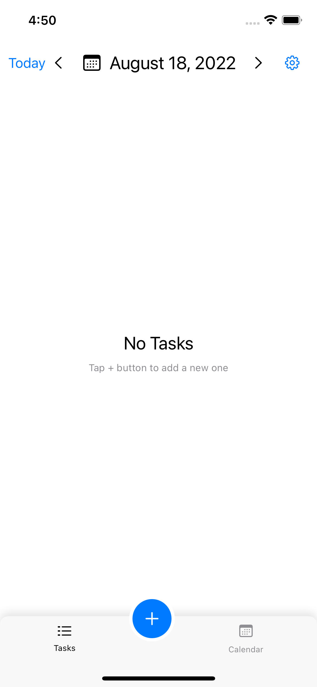
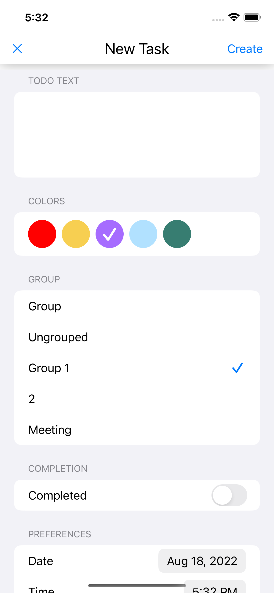
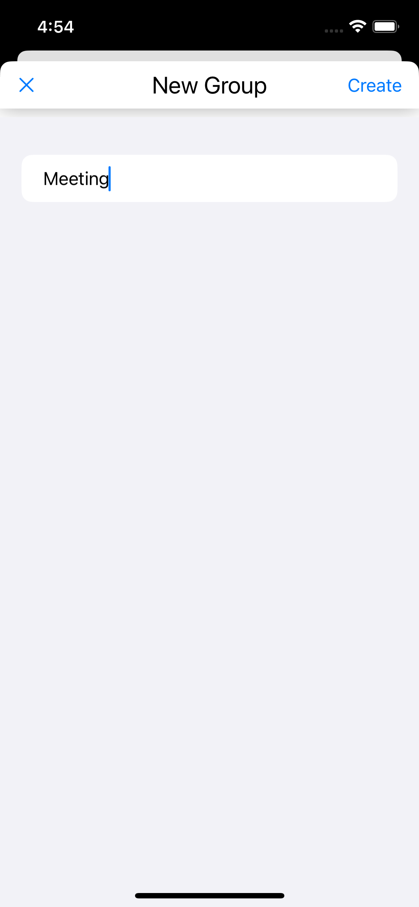
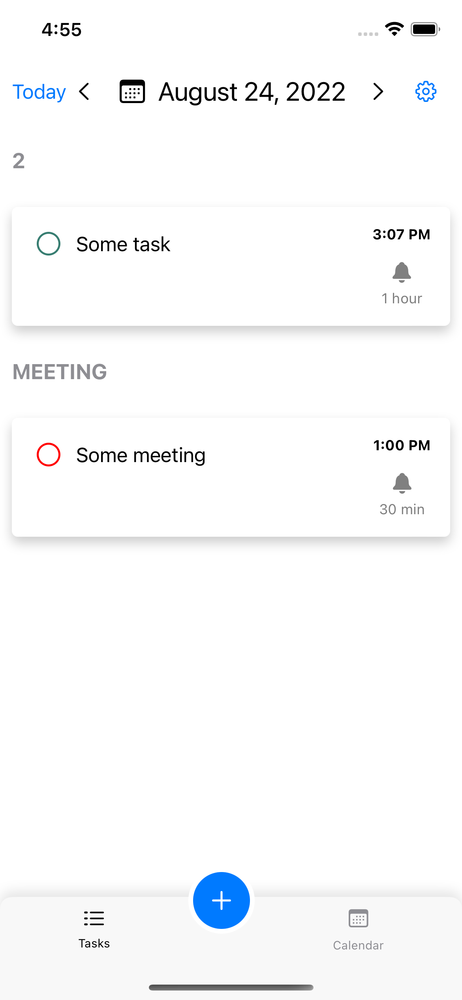
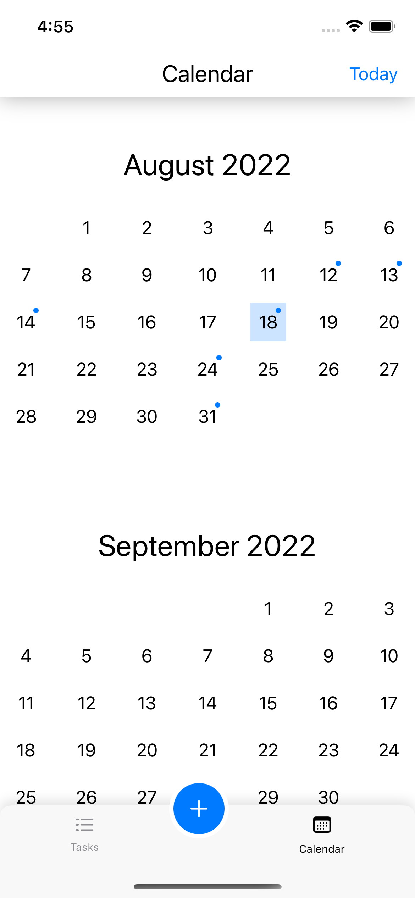

# A simple tasks app (MVVM+Coordinator)

The project goal is to try to implement the Coordinator pattern in SwiftUI. To build large-scale applications with independent modules.

## Used

 - Combine, CoreData, SwiftUI 

## Cons

- рad to stop using SwiftUI navigation and replace it with UIKit navigation

## Pros

- can build large scaled apps
- dependencies can be easy to inject into a view model

# Screensots

